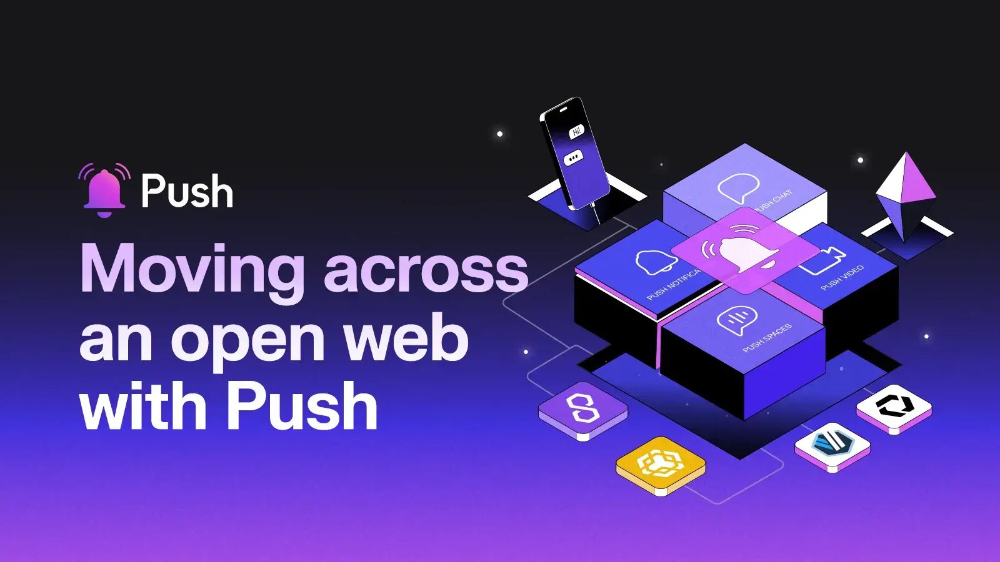
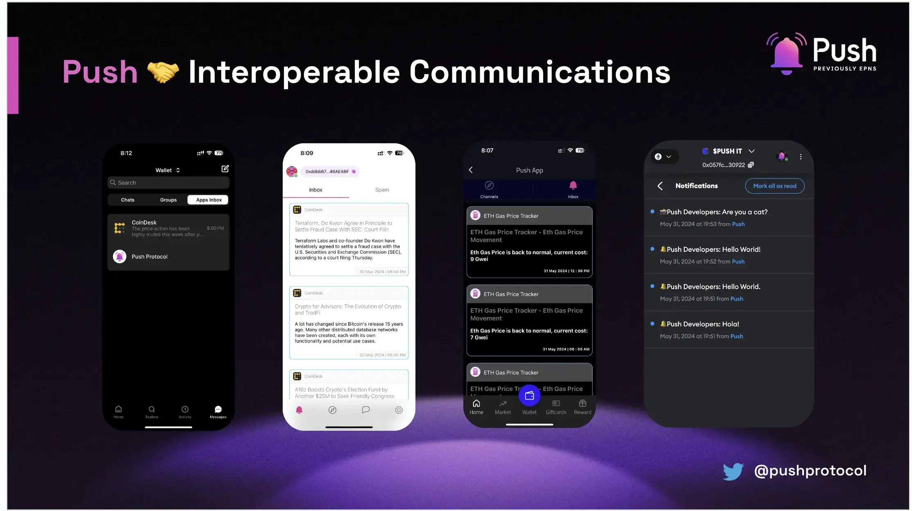
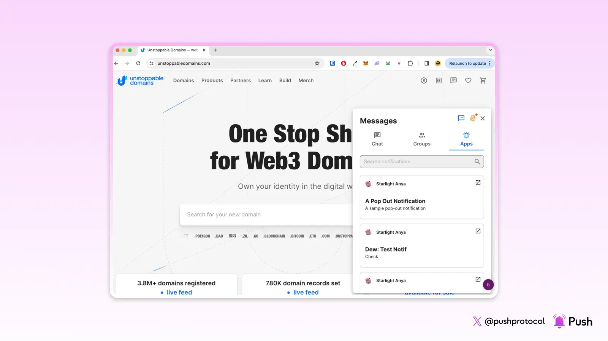

import { Image } from '@site/src/css/SharedStyling';

<!--truncate-->

With every passing day, the blockchain industry continues to become more mature and inch closer towards achieving the operational level comfort that today’s web2 world offers.

In this pursuit, we’re witnessing a period of massive experimentation in on-chain infrastructure design.

A natural trend observed in the EVM space is vertical growth through Rollups, Layer 2, and Layer 3 networks. The common goal of this design shift is to achieve scalability and, as a result, a higher degree of interoperability.

But as the web3 dev community continues to take bigger strides in achieving transactional interoperability, app-to-user, app-to-app, and user-to-user communication are still at nascent steps.

Push is working towards diminishing this divide between transactional and communication interoperability by building a robust, secure fabric that weaves multiple chains and services together by forming the **“Universal Layer2 Of Communication”**.

## Fragmented Ecosystem

Web3 operates on a multitude of blockchains, each with its own protocols, standards, and its own unique set of rules. This creates independent and isolated silos of information, making it difficult for users, services and applications built on separate chains to interact and communicate with each other unanimously.

Push continues to form a communication blanket over the fragmented ecosystem and provide its communication services to multiple EVM and non-EVM based chains. At present, Push supports over 7 networks including:

- Ethereum
- Polyogn
- Polygon zkEVM
- Arbitrum
- Binance Smart Chain (BNB)
- Fuse
- Cyber

**The Communicator contracts (Push Comm V2) serve as a middleware for listening to inbound communications** and events from the Client Application’s smart contract. Thus, shouldering the responsibility of on-chain communication across contracts deployed on multiple chains (EVM and non-EVM).

Notifications can not always be triggered as a result of an on-chain event. Many notifications, especially the ones that are more inclined towards driving engagement can be considered off-chain. Push ensures that any frontend, service, backend or smart contract can easily send communication payloads across the diverse participants and devices ( App, Wallet, Extension, Frontends and more).

## Data Availability (no communication DA layer)

Traditionally, Data Availability (DA) ensures that the data needed to validate a block is accessible to the majority of network participants. However, in the context of interoperable communications within Web3, we need a broader concept: “**Communication DA”**.

**What's the problem?** 
From an end user's perspective, app notifications and other forms of read-write communications (messaging, groupchats, videocalls) should be accessible regardless of the platform, service, hardware and underlying chain they use.  Previously, there was no standardized middleware mechanism to link communication across platforms and chains.

Push solves this problem. Being an open network, Push enables any frontend, service, or backend to securely tap into the Push network and extract the necessary communication payloads in a platform-agnostic manner. 

Simply put, **your communication travels with your web3 identity: your wallet.**

<!-- Push Delivery Node image -->

## Benefits to Protocols and DApps

### 1. Communications 🤝 Web 3 Wallets

In a typical web3 user journey, A user’s wallet , is the first element that unlocks transactional interoperability by  allowing users to seamlessly transfer assets and interact with dApps regardless of their underlying set of rules.

Push Protocol extends the scope of this interoperability by  enabling cross-chain communication in form of notifications and messaging for Dapps, wallets, and services by tying it to the wallet addresses in an open, cryptographically encrypted and gasless manner.

Notifications from various protocols and services are accessible regardless of the chains they originate from. All subscribed channel notifications are synchronized and displayed in one place within your Push-compatible wallet.

<!-- Push mODILE SCREENSHOT image -->

### Interoperable Communication tied to web3 wallets = Secret to unlock massive distribution:

According to [DApp Radar](https://dappradar.com/blog/state-of-the-dapp-industry-q1-2024), Q1 2024 saw a remarkable surge in daily active wallet users (dUAW), reaching an average of 7 million daily active wallets—a 77% increase compared to the previous year.

The numbers clearly show that the entry into web3 starts from a wallet. With more than 120 wallet apps in market, Push presents an opportunity to revolutionise their UX by reaching to these wallet addresses. And essentially pave the way to **onboard the first Billion users into web3**.

Protocols, services, and DApps can tap into a highly scalable  distribution stream with the help of Push. Push ties all application-specific communication to the user's wallet address, ensuring zero user friction and exponentially growing the client protocol's distribution.

<!-- Push Interoperable Communications Slide -->

### Communication drives collaboration and engagement:

Notifications delivered directly to users' wallets enhance a DApp's brand recall by keeping it at the forefront of users' minds. Users can interact with these notifications, enabling them to visit the DApp and view updates promptly.

When more applications can reach out to their user’s wallet, across multiple networks it opens new avenues for engagement, customer retention and brand building.

<!-- DApp Looker image -->

[DappLooker](https://dapplooker.com/): A no-code data analytics platform provides product and subscription related notifications. Users can enable / disable the notifications as per their wish via the platform.

## Benefits to User

### 1. Wallet Address: A Universal Pass for Web3 Communication

The utility of a wallet address extends beyond simply being a social identifier or a key for facilitating transactions.  It also acts as a hub for collecting, presenting and managing mission-critical communications.

<Image src={require('./image5.webp').default} alt="Push Metamask Snap" width="353" height="100%" />
<!-- Metamask Snap -->

The [Push MetaMask Snap](https://snaps.metamask.io/snap/npm/pushprotocol/snap/?utm_source=google&utm_medium=blog&utm_campaign=case_study_open_web) allows users to receive real-time notification alerts from their favourite web3 applications directly within their MetaMask wallet.

### 2. No personal information needed:
Push fascilitates Native Integration with Wallet Addresses enabling communication between wallet addresses without needing personal information like email, social handles or cellular contact info.

### 3.Security and Decentralized Communication:

With respect to communications, decentralization can be broken down into:

1. Immutability of communication payloads/messages
2. Inability to censor content.

Push maintains immutability and censorship resistance  by encrypting mission critical communication payloads and messaging chats ensuring highest standards of communication security.

Push powers wallet to wallet group chat with conditional gating form over **3.8 Million users** of [Unstoppable Domains](https://unstoppabledomains.com/) with over 300 groups made sofar.

<!-- UD chat image -->

With the onset of [Push Network](https://push.org/blog/explaining-push-nodes/?utm_source=google&utm_medium=blog&utm_campaign=case_study_open_web) in Q4, the network will achieve its largest step in achieving complete network decentralization. Which in turn will activate slashing mechanisms to deter any nodes from censorship activities.

## Communication Follows where wallet connects

Across multiple genres including, Gaming, DeFI, Governance and Wallets, Push enables multiple ways for the DApps to tap into the the protocol’s Communication DA Layer (i.e Push Network) and extract notifications in a platform agnostic manner.

For instance, [Decentraland](https://decentraland.org/) users can choose to opt into and receive notifications into the platform frontend as well as receive the notifications directly into their Metamask Snap wallet.

<!-- Decentraland Image -->

To receive updates when of a new governance proposal from Shapeshift DAO, you can either choose to receive notifications directly in your [Shapeshift](https://shapeshift.com/wallets) wallet or perhaps any other wallet that integrates Push’s open-source SDK.

<Image src={require('./image8.webp').default} alt="Shapeshift Wallet" width="353" height="100%" />
<!-- shapeshift image -->
Additionally, users can experience updates from the following applications powered by Push, according to their convenience:

- **[Push DApp](https://app.push.org/welcome?utm_source=google&utm_medium=blog&utm_campaign=case_study_open_web)**
- **[Push Browser Extension](https://chromewebstore.google.com/detail/push-protocol-alpha/lbdcbpaldalgiieffakjhiccoeebchmg?utm_source=google&utm_medium=blog&utm_campaign=case_study_open_web)**
- **[Push Android App](https://play.google.com/store/apps/details?id=io.epns.epns&hl=en_IN?utm_source=google&utm_medium=blog&utm_campaign=case_study_open_web)**
- **[Push iOS App](https://apps.apple.com/us/app/push-epns/id1528614910?utm_source=google&utm_medium=blog&utm_campaign=case_study_open_web)**

## Moving across an Open Web with Push

We believe communications is a public good and a bare necessity for a frictionless digital life. 
This also means that the means to provide communications and access them should not be limited to one or atmost two mediums.

Push invented the communication network for web3 with a similar vision of enabling communication experiences unconstrained by chains. 

**A user of chain 'X' should not only be able to communicate with other users and services on that chain but also with users and services on chain 'Y' seamlessly, without added friction.**

This is how Push is pushing towards forming a universal communication network of web3 encompassing all networks ensuring you, as a user can move across the open web along with your communications with ease.

